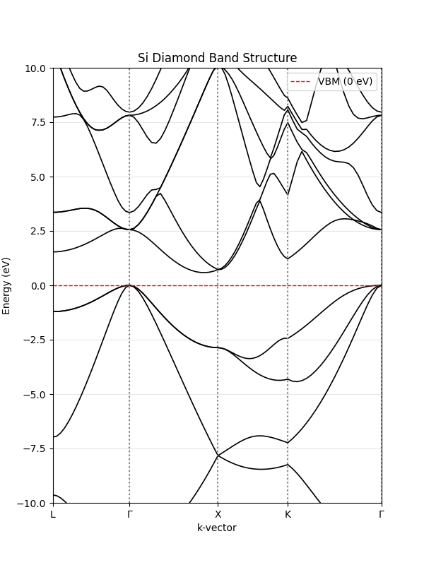

# DFT result
| mixing_beta | Iteration | Fermi level (eV) | Total energy (Ry) |
| --- | --- | --- | --- |
| 0.7 (default) | 7 | 5.9485 | -16.92088780 |
| 0.8 | 6 | 5.9484 | -16.92088780 |
| 0.5 | 8 | 5.9485 | -16.92088780 |
| 0.2 | 17 | 5.9485 | -16.91994153 |

## Band structure

Measured band gap is 0.5832 eV, which is about a half of the true value 1.12 eV. This reveals the limitation of default DFT that underestimates band gap.